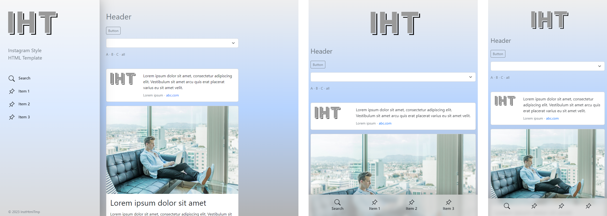
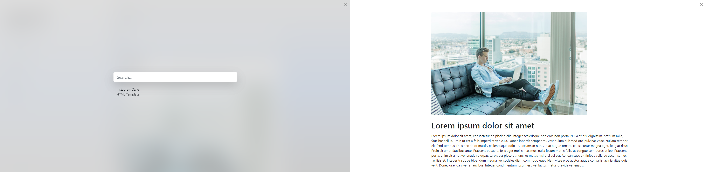

# InstHtmlTmp

## Description

The templet of web page in Instagram style. It’s a simple templet with menu and content sections, search and full content views. Created with HTML5, CSS3, JavaScript, Bootstrap v5. I used this HTML template for my projects in Laravel, PWA and other. 

## Installation

Just save all files this template in your project and configure for your goals.

## Configure

You need configure *.html files for your goals and, of course, images, correct *.css and rewrite *.js files. The menu section correct displaying four items. The content section can have information blocks or forms. The main elements is in this template other you can find in Bootstrap framework.

## Screenshot

## Author

[Evgenii Bykov](https://github.com/evgeniibykov)

## License

GNU General Public License v3.0
